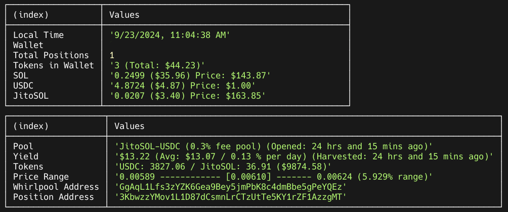

# AutoLP-Orca - LP Automation on the Orca Platform

A blockchain/Web3 project for managing liquidity positions on Solana/Orca using Orca's bundled positions NFT.

This project allows you to automate and manage concentrated liquidity positions on Orca using their bundled positions NFT. Currently, orca does not expose support for the bundled NFT via their interface, but it is far more cost effective than creating and burning an NFT each time a position is opened and closed. With AutoLP, you can choose to manually open and close positions as you like, or set up automation to ensure rebalancing under certain conditions which you can define.

## Features

- **Automated Position Management:** Open, close, and rebalance liquidity positions based on predefined criteria.
- **Fee Harvesting:** Collects fees and rewards from liquidity pools.
- **WebSocket Integration:** Connects to Jito Tips WebSocket for real-time tip updates.
- **Simple Logging:** Logs for monitoring and debugging.
- **Jito Transaction / Tip Support:** Automatically tips Jito nodes when transactions are created.
- **Positions Bundle NFT Support:** Opens and closes positions using Orca's positions bundle NFT, lowering rebalancing fees dramatically.

## Prerequisites

- Understanding of Typescript, NodeJS, Solana, Solana Web3.js, and Orca Whirlpools.
- Solana wallet
- Solana RPC URL
- NodeJS 22.x

## Installation

1. **Install Dependencies:**

   - `npm install`

2. **Ensure that your have a bundled position NFT in your wallet, or use the included function to create one**

   - `npm run create-position-bundle-nft`
   - review the transaction on solscan and retrieve the relevant addresses for your .env file

3. **Configure Environment Variables:**

   - Create a `.env` file based on `.env.example`.
   - if you do not have a solana filesystem wallet, you can create one using your secret key with `npm run create-wallet` and copy the output into your .env file under the SECRET_KEY variable
   - as you know, never share / upload the data in your .env file.

4. **Review Default Settings:**

   - review default settings in `src/config/default.ts` to ensure that they meet your needs
   - add your pool settings in `src/config/pool_settings.ts`

## Usage

To open a new position, you need the get the address of the whirlpool from the Orca website, and then run the open command with the whirlpool address:

- `npm run open <whirlpool_address>`

Some commands require the whirlpool address, others require the position address. To see all open positions and their addresses, run:

- `npm run print`

- Review all the other commands in `package.json` or in `src/commands/`

## Relevant Links

- Orca Website: https://www.orca.so/
- Orca Developer Portal: https://orca-so.gitbook.io/orca-developer-portal/
- Orca Type References: https://orca-so.github.io/whirlpools/legacy/

## Default Settings:

- Min balance of SOL to always leave in wallet: 0.25
- Min amount to swap and deposit into a position: $10
- Swap Loss: defined as a percentage for each pool in config/pool_settings.ts
- Liquidity: 2% slippage allowance for deposits/withdrawals
- Jito Tip: 75th percentile / min 50k / max 100k

## Possible Future Features

- improve file logging: migrate to winston, add more data
- UI front end
- open new whirlpool code (support to open pools that do not exist, currently can be done via Orca's website)
- seperate fee payer wallet support
- enhanced formatting
- additional price correlation tool
- optionally set mid price of a new position to market price data, not the whirlpool's current price
- enhanced analytics
- migrate to using bottleneck for custom rate limiting

## Possible Future Improvements

- improve handling of extreme price swings, depegging events
- position vs whirlpool address use review / consistency
- optimizations of Orca and RPC data fetches
- append Jito fee to tx rather than as a seperate transaction
- general review / optimizations
- simplify position bundle addresses in .env file a single address
- move pool_settings.ts to an env file

## Disclaimer

This project isn't affiliated with Orca. There is no guarantees of any kind including loss of tokens. While it has been tested, it has not been audited nor tested extensively.
